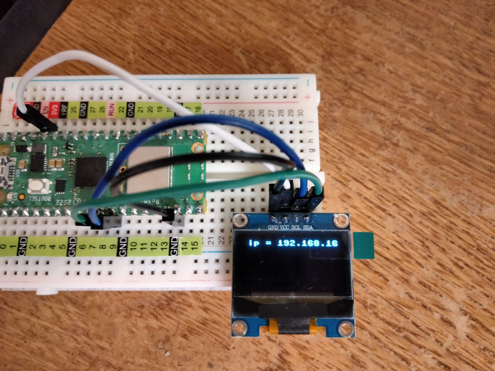
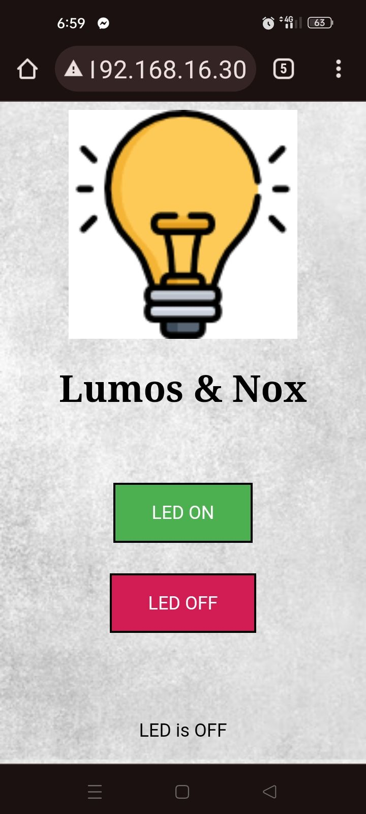

# **Tecnológico Nacional de México**
# **Instituto Tecnológico de Tijuana**
# **Subdirección Académica**
# **Depto de Sistemas y Computación**
# **SEMESTRE: AGOSTO – DICIEMBRE 2023**
# **Ing. En Sistemas Computacionales**
# **SISTEMAS PROGRAMABLES 23a**
# **Estevez Ramirez Maria Teresa - 20211773**
## FECHA: 19 de octubre del 2023

# **Embeded Web Server PicoW**
## Código 
```python
# Alumno: Estevez Ramirez Maria Teresa
# No. control: 20211773

import time
import network
import socket
from machine import Pin
import ssd1306

led = machine.Pin("LED", machine.Pin.OUT)
ledState = 'LED State Unknown'

ssid = 'OPPO A53'
password = 'f082dd9d35a2'

# Configura los pines SDA y SCL para la comunicación I2C
i2c = machine.I2C(0, sda=machine.Pin(8), scl=machine.Pin(9))

# Configura el objeto SSD1306 para la pantalla OLED
oled = ssd1306.SSD1306_I2C(128, 64, i2c)

wlan = network.WLAN(network.STA_IF)
wlan.active(True)
wlan.connect(ssid, password)

html = """<!DOCTYPE html><html>
<head><meta name="viewport" content="width=device-width, initial-scale=1">
<link rel="icon" href="data:,">
<style>html { font-family: Helvetica; display: inline-block; margin: 0px auto; text-align: center;}
.buttonGreen { background-color: #4CAF50; border: 2px solid #000000;; color: white; padding: 15px 32px; text-align: center; text-decoration: none; display: inline-block; font-size: 16px; margin: 4px 2px; cursor: pointer; }
.buttonRed { background-color: #D11D53; border: 2px solid #000000;; color: white; padding: 15px 32px; text-align: center; text-decoration: none; display: inline-block; font-size: 16px; margin: 4px 2px; cursor: pointer; }
text-decoration: none; font-size: 30px; margin: 2px; cursor: pointer;}
<title>Control Panel</title>
    <style>
        body {
            font-family: Georgia, sans-serif;
        }

        h1 {
            font-family: 'Lucida Sans', serif;
            font-weight: bold;
        }

        .buttonGreen, .buttonRed {
            font-family: Century Gothic, sans-serif;
        }
    </style>
<body>
    
    <center><h1>Lumos & Nox</h1></center><br><br>
    <form>
        <center>
        <center> <button class="buttonGreen" name="led" value="on" type="submit">LED ON</button>
        <br><br>
        <center> <button class="buttonRed" name="led" value="off" type="submit">LED OFF</button>
    </form>
    <br><br>
<style>
    body {
        background-image: url('https://img.freepik.com/foto-gratis/muro-hormigon-gris-claro_53876-89532.jpg');
        background-size: cover; /* Para que la imagen cubra toda la ventana del navegador */
    }
</style>
<br><br>
<p>%s<p></body></html>
"""

# Wait for connect or fail
max_wait = 10
while max_wait > 0:
    if wlan.status() < 0 or wlan.status() >= 3:
        break
    max_wait -= 1
    print('waiting for connection...')
    time.sleep(1)
    
# Handle connection error
if wlan.status() != 3:
    raise RuntimeError('network connection failed')
else:
    print('Connected')
    status = wlan.ifconfig()
    print( 'ip = ' + status[0] )
    # Dibuja "Hola Mundo" en la pantalla
    oled.text('ip = ' + status[0], 5, 0)
    # Actualiza la pantalla para mostrar el texto
    oled.show()     
    
# Open socket
addr = socket.getaddrinfo('0.0.0.0', 80)[0][-1]
s = socket.socket()
s.bind(addr)
s.listen(1)
print('listening on', addr)

# Listen for connections, serve client
while True:
    try:       
        cl, addr = s.accept()
        print('client connected from', addr)
        request = cl.recv(1024)
        print("request:")
        print(request)
        request = str(request)
        led_on = request.find('led=on')
        led_off = request.find('led=off')
        
        print( 'led on = ' + str(led_on))
        print( 'led off = ' + str(led_off))
        
        # Limpia la pantalla
        oled.fill(0)
        oled.show()
        
        if led_on == 8:
            print("led on")
            led.value(1)
        if led_off == 8:
            print("led off")
            led.value(0)
        
        ledState = "LED is OFF" if led.value() == 0 else "LED is ON" # a compact if-else statement
        
        # Create and send response
        stateis = ledState
        response = html % stateis
        cl.send('HTTP/1.0 200 OK\r\nContent-type: text/html\r\n\r\n')
        cl.send(response)
        cl.close()
        
    except OSError as e:
        cl.close()
        print('connection closed')

```
## Simulación del circuito


## Curcuito


## ENCENDIDO

> Web

> Encendido

## Apagado

> Web

> Apagado
